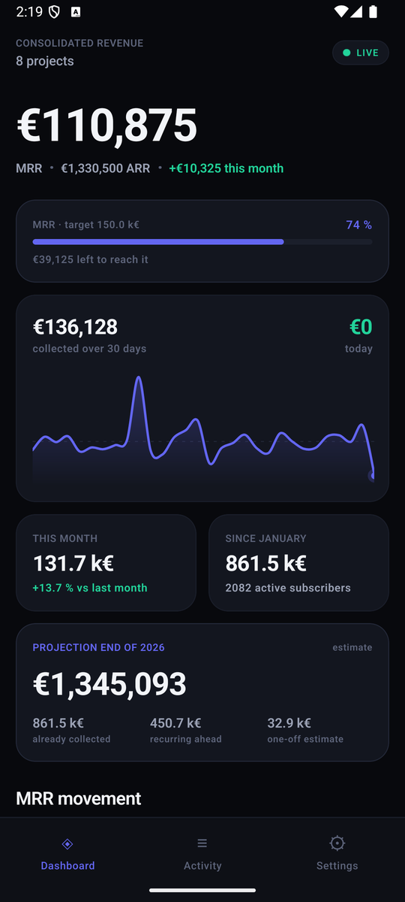
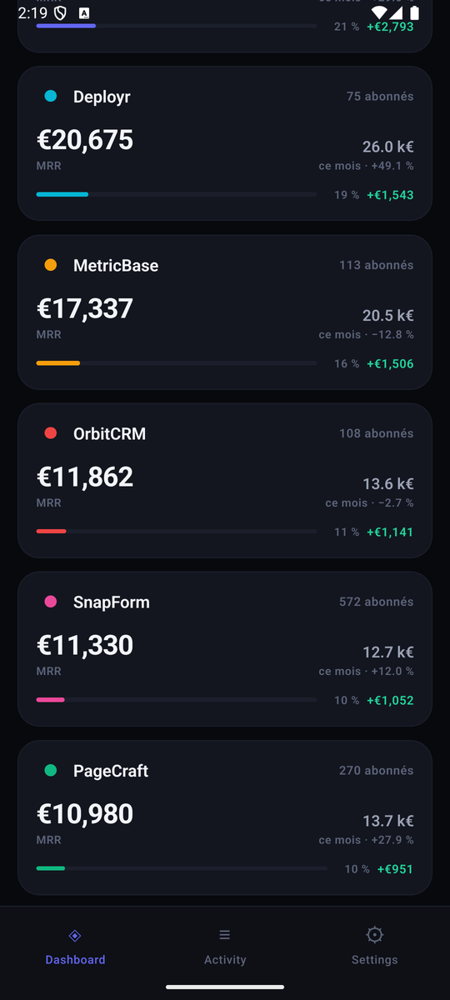
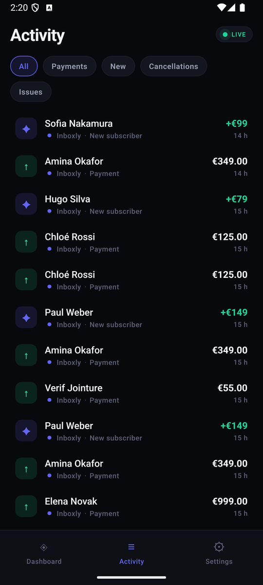

<div align="center">

# Private MRR

**Track revenue across many Stripe accounts, in real time, from your own phone.**

Self-hosted. Your Stripe keys never leave your server.

[](LICENSE)


</div>

---

<div align="center">



</div>

<div align="center">
<sub>Screenshots use generated demo data, not real revenue.</sub>
</div>

---

## What this is

If you run several products, each with its own Stripe account, there is no single
place that tells you how much you actually earn. Stripe shows one account at a
time. Analytics tools want your secret keys.

Private MRR consolidates all of them into one number, pushes a notification the
second a payment lands, and runs entirely on hardware you control.

**It answers, at a glance:** what is my MRR right now, how much came in today,
how does this month compare to last, and where will I land by year end.

## Why the keys stay on the server

A Stripe secret key embedded in a mobile app is extractable in minutes — the
JavaScript bundle is readable on-device, even in a release build. And a secret
key does far more than read: refunds, transfers, charges.

So the split is deliberate:

```
   Stripe accounts (N)
        │
        │  signed webhooks  ← real time, ~1s
        │  REST API         ← history + hourly reconciliation
        ▼
   ┌──────────────────────────────┐
   │  YOUR SERVER                 │
   │  ┌────────────────────────┐  │
   │  │ Reverse proxy (HTTPS)  │  │
   │  └───────────┬────────────┘  │
   │              │ 127.0.0.1     │
   │  ┌───────────▼────────────┐  │
   │  │ Node · SQLite          │  │
   │  │ ← the Stripe keys      │  │
   │  └───────────┬────────────┘  │
   └──────────────┼───────────────┘
                  │ HTTPS · bearer token · SSE
                  ▼
           Android app (zero Stripe keys)
```

The app holds a **read-only token to your own API**. Compromised, it exposes
your own numbers and nothing else — and you revoke it by changing one line.

**Use restricted Stripe keys** (`rk_live_…`), read-only on four resources:
Charges, Customers, Invoices, Subscriptions. The server warns in its logs if it
detects a full secret key.

## Features

| | |
|---|---|
| **Real time** | Signed Stripe webhooks, pushed to the phone in about a second |
| **Multi-account** | One Stripe account per project, one consolidated view |
| **Notifications** | Payment, renewal, new subscriber, cancellation, failure — per-project toggles, amount threshold, cash-register sound |
| **Metrics** | MRR, ARR, MTD, YTD, year-end projection, new/expansion/contraction/churn |
| **Goals** | Per project and global, expressed in MRR or ARR |
| **Home screen widget** | Resizable, three information densities |
| **Multi-currency** | Converted to your base currency, rates refreshed daily |
| **Branding** | Project logos pulled automatically from Stripe account branding |
| **Bilingual** | English and French, follows the device language |

## What you need

- A server with Docker and a reverse proxy (nginx, Caddy, Traefik…)
- A domain name pointing at it
- One or more Stripe accounts
- A Firebase project — free, for push notifications
- Node 20+ and the Android SDK, to build the APK

**Not a developer?** See **[SETUP-WITH-AI.md](SETUP-WITH-AI.md)** — a document
written to be handed to Claude or ChatGPT, which will walk you through every
step.

---

## Setup

### 1 · Server

```bash
git clone https://github.com/minipouce/private-mrr.git /opt/private-mrr
cd /opt/private-mrr/server
cp .env.example .env && chmod 600 .env
openssl rand -hex 32   # paste into API_TOKEN
```

### 2 · Declare your Stripe accounts

One helper call per project — it generates correctly named variables, which is
exactly where hand-written blocks silently break:

```bash
npm run add-project -- my-saas "My SaaS"
```

Then paste each key into `.env`:

```bash
PROJECTS=my-saas,my-tool

PROJECT_MY_SAAS_NAME="My SaaS"
PROJECT_MY_SAAS_STRIPE_KEY=rk_live_xxx
PROJECT_MY_SAAS_WEBHOOK_SECRET=          # filled in step 5
PROJECT_MY_SAAS_COLOR="#6366f1"
```

> **Quote the colour.** Unquoted, `dotenv` reads `#` as a comment and the value
> is silently lost.

**Creating a restricted key:** Stripe → *Developers → API keys → Create
restricted key*. Set these four to **Read**, everything else to *None*:
Charges, Customers, Invoices, Subscriptions.

Add **Account** read as well if you want project logos pulled automatically.

### 3 · Firebase, for notifications

Notifications go **straight from your server to Firebase** — Expo's push service
is not involved, so notification content reaches no third party beyond Google.

1. Create a project on [console.firebase.google.com](https://console.firebase.google.com)
2. *Add app → Android*, package name matching `app.json` (`android.package`)
3. Download `google-services.json` into `app/`
4. *Project settings → Service accounts → Generate new private key*
5. Save that JSON as `server/credentials/fcm-service-account.json`, `chmod 600`
6. Delete your local copy — it is a Firebase admin credential

Skip this and everything works except push notifications; the server says so at
startup.

### 4 · Start

```bash
docker compose up -d --build
curl -s localhost:8791/health   # {"ok":true}
```

Point your reverse proxy at `127.0.0.1:8791`. See
[`server/Caddyfile.example`](server/Caddyfile.example), or for nginx:

```nginx
location /api/stream {
    proxy_pass http://127.0.0.1:8791;
    proxy_http_version 1.1;
    proxy_set_header Connection "";
    proxy_buffering off;          # required: SSE must not be buffered
    proxy_read_timeout 24h;
}

location / {
    proxy_pass http://127.0.0.1:8791;
    proxy_set_header X-Forwarded-For $proxy_add_x_forwarded_for;
}
```

> Without `proxy_buffering off`, live events arrive in batches instead of as
> they happen.

### 5 · Stripe webhooks

For **each** account: Stripe → *Developers → Webhooks → Add endpoint*

```
https://your-domain/webhooks/stripe/<project-id>
```

Events to send:

```
invoice.paid                       charge.refunded
invoice.payment_failed             customer.subscription.created
charge.succeeded                   customer.subscription.updated
                                   customer.subscription.deleted
```

Paste each `whsec_…` into the matching `PROJECT_<ID>_WEBHOOK_SECRET`, then:

```bash
docker compose up -d --force-recreate
```

> **`restart` is not enough after editing `.env`.** Environment variables are
> injected at container *creation*; a restart silently keeps the old values.

### 6 · Build and install the app

```bash
cd app
npm install
npm run keystore     # once — keep this file, see the warning below
npm run prebuild
npm run apk
adb install -r android/app/build/outputs/apk/release/app-release.apk
```

Lighter build for a modern phone (ARM 64-bit — anything since 2019), roughly
half the size:

```bash
cd android && ./gradlew assembleRelease -PreactNativeArchitectures=arm64-v8a
```

> **Keep `app/credentials/release.keystore` and its password.** Android refuses
> to update an app signed with a different key. Lose it and the only way out is
> uninstalling — losing the app's local configuration with it.

On first launch, enter your server URL and API token, then
*Settings → Enable notifications*.

**Forking?** Override the app identity without touching `app.json`:

```bash
APP_PACKAGE=com.you.mrr EAS_OWNER=you EAS_PROJECT_ID=… npm run apk
```

---

## Metrics

| Metric | Definition |
|---|---|
| MRR | Sum of `active` and `past_due` subscriptions, every billing interval normalised to a month. Trials are tracked separately. |
| ARR | MRR × 12 |
| This month / Since January | Actual cash collected, refunds deducted |
| vs last month | Like-for-like: the same number of days elapsed last month |
| Year-end projection | Collected + MRR over remaining months + a 90-day average of one-off revenue |
| MRR movement | New, expansion, contraction, churn — their sum explains the month's change |

Multi-currency amounts are converted to `BASE_CURRENCY` using rates refreshed
daily from [Frankfurter](https://frankfurter.app) (no API key).

## Operating

```bash
docker compose logs -f --tail 100
docker compose up -d --force-recreate     # after editing .env
docker compose exec mrr node dist/cli/backfill.js --force
```

Everything lives in one SQLite file:

```bash
docker compose exec mrr sh -c "sqlite3 /data/mrr.db '.backup /tmp/b.db'" \
  && docker compose cp mrr:/tmp/b.db ./backup-$(date +%F).db
```

The database is fully rebuildable from Stripe, but a backup saves replaying
24 months of history.

An hourly reconciliation catches any webhook missed during a redeploy or an
outage — it is the safety net under the real-time path.

## Development

```bash
cd server
cp .env.example .env      # set DEMO_MODE=true, leave PROJECTS empty
npm install
npm run seed -- --reset   # 8 fictional projects, 24 months of history
npm run dev
```

```bash
cd app && npm install && npx expo start
```

From an Android emulator, the host machine is reachable at
`http://10.0.2.2:8791`.

Push notifications do not work in Expo Go since SDK 53 — you need a development
build or the release APK.

## Security notes

- Stripe keys live only on the server, never in the app bundle
- Webhook signatures verified against the raw body, with a five-minute window
  that also blocks replay of a captured legitimate webhook
- API token compared in constant time
- Token stored in the Android keystore, never in plain-text storage
- Cleartext HTTP refused except loopback and the emulator alias
- `/health` reveals nothing; volumes and device counts sit behind the token
- Container runs unprivileged with a read-only filesystem
- Logs redact `Authorization` and `stripe-signature`

## Built by

**Tristan Berguer**

[X · @TBerguer](https://x.com/TBerguer) · [LinkedIn](https://www.linkedin.com/in/tristanberguer/)

Released under the [MIT License](LICENSE). Use it, fork it, sell what you build
with it.
